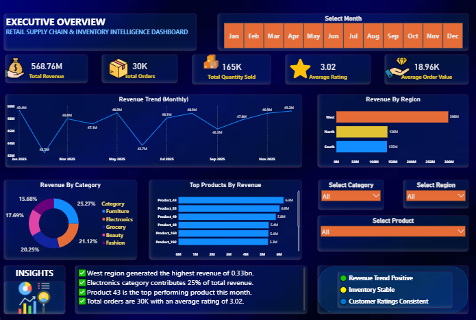
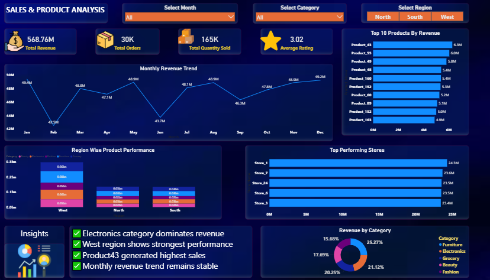
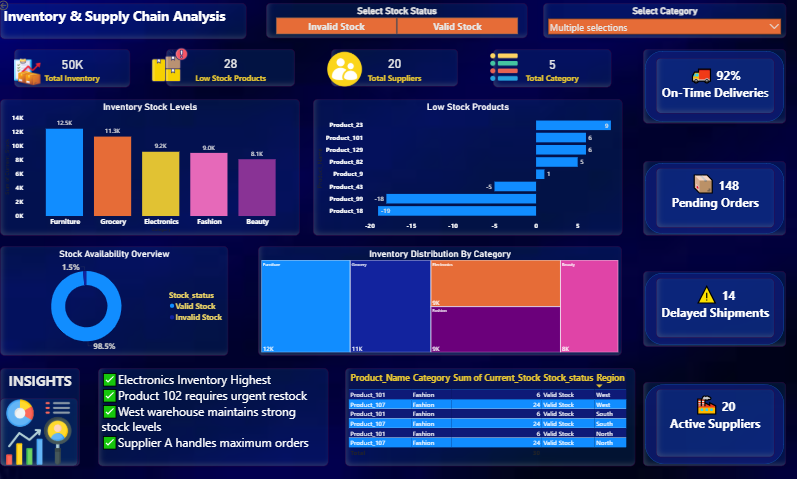

# Retail Supply Chain Analytics Dashboard using Power BI

## Overview
This project focuses on analyzing retail sales, inventory management, and supply chain operations using Power BI. Interactive dashboards were developed to monitor KPIs, analyze sales trends, track inventory performance, and identify supply chain risks.

---

## Tools & Technologies
- Power BI
- DAX
- Power Query
- Excel
- Data Modeling

---

## Dashboard Preview

### Executive Overview Dashboard

### Sales & Product Analysis Dashboard

### Inventory & Supply Chain Dashboard

---

## KPIs Used
- Total Revenue
- Total Profit
- Total Orders
- Inventory Value
- Delayed Shipments
- Active Suppliers
- Low Stock Products

---

## Key Insights
- Electronics category contributed significantly to inventory distribution
- Some products showed critically low stock levels
- Delayed shipments impacted supply chain performance
- Regional sales performance varied across different store locations

---

## Project Structure

Retail-Supply-Chain-Analytics/
│
├── assets/
├── data/
├── documentation/
├── powerbi/
├── reports/
└── README.md

---

## Learning Outcomes
This project enhanced skills in Power BI dashboard development, data modeling, KPI analysis, business intelligence reporting, and interactive data visualization.
